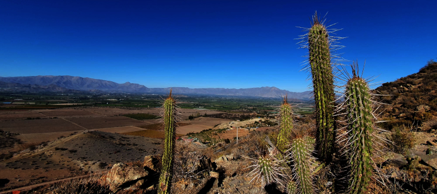

  

## Overview  

We investigate how biodiversity is structured across space and time, how it responds to global change, 
and how these dynamics shape ecosystem functioning and resilience. We combine functional ecology, biogeography,
and ecological synthesis to understand biodiversity patterns and their consequences for ecosystems.

## Functional ecology and biogeography  

We examine how functional traits shape species distributions, community assembly, 
and biodiversity patterns across environmental and anthropogenic gradients. By integrating 
functional trait data with species occurrence and abundance data, 
we seek to understand the processes underlying variation in biodiversity across spatial 
and environmental contexts.  

## Global change and ecosystem resilience

We investigate how global change drivers — biological invasions, pollution, climate change, and land-use change — 
alter biodiversity and ecosystem functioning. We apply ecological theory and quantitative approaches to understand 
how ecosystems respond to global change and the mechanisms that shape their resistance, recovery, and resilience.

## Biodiversity monitoring

Because biodiversity changes across space and time, effective monitoring requires scalable and integrative approaches. 
We develop open and data-driven approaches to improve biodiversity assessment and monitoring by integrating species 
occurrence and abundance data with functional trait data. Our work contributes to open biodiversity infrastructure, 
including [Rasgos-CL](https://www.rasgos.cl), and to national and global biodiversity monitoring initiatives through 
collaborations with organizations such as the [Data Observatory Foundation](https://www.dataobservatory.net/) and 
[GEO BON](https://geobon.org/), with the aim of making biodiversity data more accessible and actionable for research, 
monitoring, and conservation.
